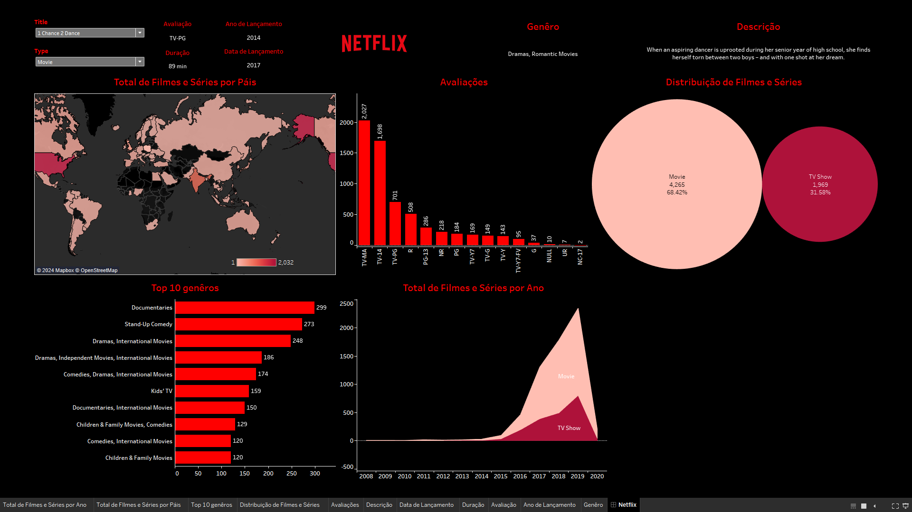

# Projeto: Dashboard Netflix - Análise de Conteúdo e Tendências de Streaming

### ➡️ Análise Detalhada e Dashboard Interativo no Meu Portfólio:
[Acesse a página completa do projeto aqui](https://ferreiragabrielw.github.io/portfolio-gabriel/projetos/Dashboards/9TableauDashboard/Projeto9DA.html)

---

## Sobre o Projeto

Este projeto apresenta um Dashboard analítico, construído no **Tableau**, com foco na vasta biblioteca de conteúdo da Netflix. O objetivo é explorar e visualizar tendências de filmes e séries, a distribuição de gêneros, classificações etárias e o volume de lançamentos ao longo dos anos. Ele visa capacitar analistas de conteúdo e estrategistas de mercado a compreender melhor o portfólio da Netflix e as preferências do público.

## Tecnologias e Processo

* **Ferramenta**: Tableau Desktop.
* **ETL**: Dados extraídos de um único arquivo CSV (`netflix_titles.csv`), transformados (ajustes de tipo, criação de campos calculados) e carregados diretamente no Tableau.
* **Insights Chave**: Predominância de filmes, classificações etárias mais comuns (TV-MA, TV-14), top 10 gêneros (Documentários, Stand-Up Comedy), e tendência de crescimento de lançamentos (picos entre 2017-2020).

## Conteúdo do Repositório

* `data/`: Base de dados (`netflix_titles.csv`) utilizada.
* `dashboard/`: Arquivo `.Netflix.pdf` com o dashboard Netflix.
* `quarto/`: Arquivo .qmd e sua versão HTML renderizada.
* `README.md`: Este documento.
* `LICENSE`: Licença do projeto (MIT License).

## Como Visualizar

* **Online**: [Acesse o dashboard publicado no Tableau Public](https://public.tableau.com/app/profile/gabriel.ferreira2491/viz/DashboardTableauNetflix/Netflix?publish=yes)

---

### Licença

Este projeto está licenciado sob a [MIT License](LICENSE).
